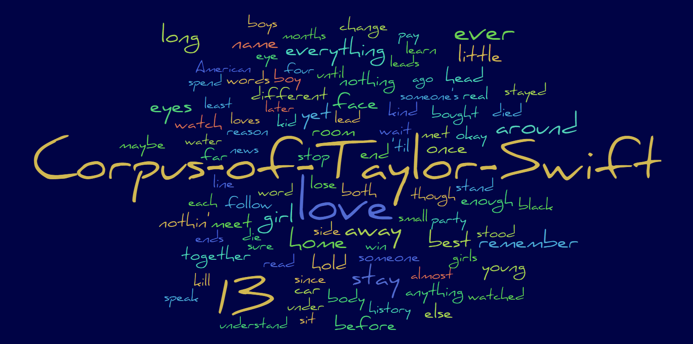
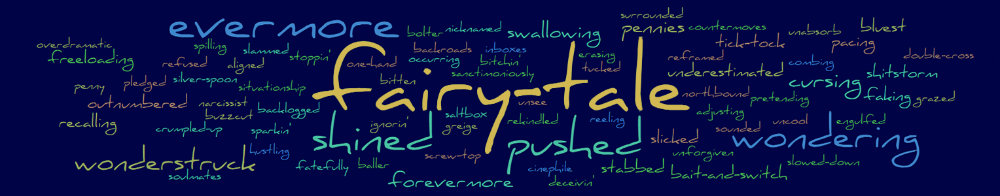

# Corpus of Taylor Swift _(CoTS)_

# Introduction

This is a dataset consisting of all song lyric words found on all of Taylor Swift's studio albums, as well as a selection of other songs written by her. Each unique lyric word is assigned various categorisations and statistics by CoTS, that can be used to understand how and where each word is used in one or more lyrics, songs and/or albums. 

CoTS is generated using 'Taylor's Version' album lyrics where available, and includes all bonus tracks or 'from the vault' songs. There is intent to keep this dataset updated as new material is released in future.

Happy browsing and friendship bracelet making! 🐈

# Word Categorisation

CoTS assigns word frequencies, parts of speech (PoS) and word variants to lyric words as defined by the [Word Frequency in Written and Spoken English (WFWSE)](https://ucrel.lancs.ac.uk/bncfreq/flists.html) list. 

Lyric words have also been categorised using the [Oxford 5000 by CEFR level](https://www.oxfordlearnersdictionaries.com/wordlists/oxford3000-5000) word list, which ranks words based on their importance to a language using the [Common European Framework of Reference for Languages (CEFR)](https://www.coe.int/en/web/common-european-framework-reference-languages/level-descriptions).

CoTS also utilises the [Oxford English Corpus (OEC) top 100 most frequent words](https://en.wikipedia.org/wiki/Most_common_words_in_English) of the English language, as described in several sections below.

To ensure as complete lyric word categorisation as possible, the following have been added to WFWSE word variants, as applicable:

- American word spellings, eg. `marvelous` added as a variant of `marvellous`
- common acronyms, eg. `TV` or `PJs` added as variants of `television` and `pyjama` respectively
- simple contractions, eg. `'cause` or `playin'` added as variants of `because` and `playing` respectively
- possessive nouns, eg. `friend's` or `parents'` added as variants of `friend` and `parent` respectively
- numeric forms of numbers, eg. `13`🐍 added as a variant of `thirteen`

Moreover, the following lyric words have been replaced with WFWSE equivalents: 

- `rollercoaster` is listed as `roller-coaster`
- `lighthearted` is listed as `light-hearted`
- `nightlight` is listed as `night-light`
- `fairytale` is listed as `fairy-tale` 📘
- `namedropping` is listed as `name-dropping`
- `takeout` is listed as `take-out`

# Housekeeping

## Album Codes

For brevity, CoTS uses the following album codes when referring to albums:

- `TSW` - Taylor Swift _(aka Debut)_
- `FER` - Fearless
- `SPN` - Speak Now
- `RED` - Red
- `NEN` - 1989
- `REP` - Reputation
- `LVR` - Lover 💌
- `FOL` - Folklore
- `EVE` - Evermore 
- `MID` - Midnights
- `TPD` - The Tortured Poets Department
- `OTH` - Other Songs

> [!NOTE]
> CoTS now includes all song lyrics from the 'The Tortured Poets Department' album.

## Song Selection

To prevent duplicate counts of lyric words, versions of songs that are pure remixes or acoustic/piano etc performances of original songs are not included in CoTS. Furthermore, versions of songs that have substantial additional lyrics have been selected in place of their original versions. Currently the two such substituted songs are:

- the '10 Minute Version' version of 'All Too Well' on the album 'Red'
- the 'Feat. More Lana Del Rey' version of ❄'Snow On The Beach' on the album 'Midnights'

## Supplemental Files

The following files are provided in addition to the main CoTS file:

- [lyrics/album-song-lyrics.json](lyrics/album-song-lyrics.json) - This is the raw album, song and lyric dataset used to compile CoTS.
- [lyrics/album-song-lyrics.json](lyrics/flat-song-lyrics.json) - This is the same flat set of lyric lines that is provided in CoTS.
- [tsv/cots-word-details.tsv](tsv/cots-word-details.tsv) - A flat version of the CoTS 'WordDetails' worksheet.
- [tsv/cots-song-details.tsv](tsv/cots-song-details.tsv) - A flat version of the CoTS 'SongDetails' worksheet.
- [tsv/cots-album-details.tsv](tsv/cots-album-details.tsv) - A flat version of the CoTS 'AlbumDetails' worksheet.

# Corpus Parts

The corpus is provided in four parts, representing details and statistics of lyric words, songs, albums and lyrics. Details of the columns that comprise each of these parts are provided below.

## Word Details 💬

This part is the main body of the corpus and lists each lyric word along with various categorisation, statistical and labelling columns related to each word, as defined below.

### Word

A word that appears one or more times, in one or more lyric lines, on one or more songs. These are primarily presented in lower case, apart from proper nouns such as `Emma`, `Hollywood` or `January`. Variations of a word or multiple tenses of the same word are grouped together in the same frequency banding/rank (eg. the words `sayin'`, `says` and `say` all share the same `FqBand`, `OECRank` and `CEFRLevel`, as do separately the words `doing`, `does`, `done`, `did` and `do`).

> [!NOTE]
> Some proper nouns such as place names or names of individuals have been hyphenated to preserve single word consistency when searching, eg. `New-York`, `Miss-Americana` and `Tim-McGraw`. Additionally, the word `I` is listed as `i`, for clarity.

### PoSes _(Part of Speech)_

These are the standard grammatical categorisations that are assigned to English language words. Multiple PoS categories are often assigned to each lyric word in CoTS, and are listed in order of that word's PoS WFWSE frequency. These multiple assignments occur due to the presence of many homographic words in English. Such words are spelled the same but have different meanings. Consider the word `close`, which can be an adjective, adverb, noun or verb; or the word `minute` which can be an adjective, noun or verb.

Standard PoS categories appear abbreviated within CoTS as follows:

- `Adje` - Adjective
- `Adve` - Adverb
- `Arti` - Article
- `Conj` - Conjunction
- `Dete` - Determiner
- `Inte` - Interjection
- `Infi` - Infinitive Marker
- `Noun` - Noun 🌈
- `Numb` - Number
- `Prep` - Preposition
- `Pron` - Pronoun 
- `Verb` - Verb

Additionally, the following non-standard categories have been added for contractions (eg. `doesn't`, `should've`, `wanna`), proper nouns (eg. `London`, `Halloween`, `James`) and currently unclassified words:

- `Cont` - Contraction
- `Prop` - Proper Noun 
- `Uncl` - Unclassified

> [!NOTE]
> A small number of compound words, irregular interjections, non-words etc. (eg. `wine-stained`, `ooh-hoo-hoo`, `3AM`) are currently marked as `Uncl`. These may be classified in future versions of CoTS.

### FqBand _(Frequency Band)_

This is a word frequency band that each lyric word has been assigned. It has been derived from the WFWSE word frequency, and using the [Fibonacci numbers F11 to F24](https://www.math.net/list-of-fibonacci-numbers) as banding boundaries, values of `🚩1` to `🚩16` have been assigned. The higher the band value, the less frequently a word occurs in English, according to the WFWSE.

As described in the [PoSes](https://github.com/sagesolar/Corpus-of-Taylor-Swift#poses-part-of-speech) column, due to the homographic nature of many English language words, many lyric words are assigned multiple word frequency values. In order to present a single frequency band for each lyric word, the highest frequency value PoS of each lyric word was used when assigning a word's frequency band.

> [!NOTE]
> Around 300 lyric words have not been assigned a frequency band, as they are not present in the WFWSE list. These include contractions, proper nouns, compound words and irregular interjections.

### OECRank _(Oxford English Corpus Rank)_

The top 100 OEC ranked words of the English language are labelled 1-100 in this column. CoTS utilises these ranked words in several columns, such as [NextWord](https://github.com/sagesolar/Corpus-of-Taylor-Swift#nextword1-2-3), [Reps](https://github.com/sagesolar/Corpus-of-Taylor-Swift#reps-repetitions) and [PrevalentWords](https://github.com/sagesolar/Corpus-of-Taylor-Swift#prevalentverb--adjective--noun). Therefore, these words ranks are provided in this column for reference. Due to WFWSE word variants, some OEC rankings appear more than once in the column (see the [Word](https://github.com/sagesolar/Corpus-of-Taylor-Swift#word) column regarding word variant/tense groupings).

> [!NOTE]
> Unlike the WFWSE, the OEC categorises the words `a` and `an` separately, so for the purposes of the OEC rank they are treated as separate words, with ranks of `6` and `32` respectively. This is the only instance that such denormalization occurs.

### CEFRLevel _(Common European Framework of Reference for Languages Level)_

The 5000 most important words of the English language, as defined by the Oxford 5000 CEFR list, are provided in this column. They are categorised into the following bands in order of word simplicity when learning a language:

- `A1`
- `A2`
- `B1`
- `B2`
- `C1`
 
The Oxford 5000 CEFR list does not include 'C2' categorised words, however non-categorised words in this column can be interpreted as less important than words within the list, or more difficult to learn or both.

### NextWord[1-2-3]

Each lyric word in CoTS is listed with its next three most frequently occurring words in these columns. For example, the lyric word `high` has the `NextWord[1-2-3]` values:

[ `infidelity (6)`, `heels (4)`, `above (3)` ]

This can be read as the most frequent next word occurrence for the lyric word `high` across all songs and albums is `infidelity`, occurring 6 times. The next most frequent word occurrence is `heels`, occurring 4 times and the one after that is `above`, occurring 3 times. 

If 'next' words share the same occurrence count, then they are presented in order of Album/Track Number occurrence.

In an effort to increase the interest of these 'next' word columns, and as to not inundate them with very common words, the top 50 words of the OEC have been filtered out of the columns. Furthermore 'next' words occurring within subsequent parenthesis or after punctuation marks (excluding commas) are not counted. 

Repeated words are also not included, as these are instead counted in the [Reps](https://github.com/sagesolar/Corpus-of-Taylor-Swift#reps-repetitions) column. Lastly, a word occurring at the end of a lyric line has no 'next' word, and if that is the only occurrence of the word across all songs and albums, it will have no 'next' words assigned.

Lyric examples

Consider the following lyrics:

1. >_In a storm, in my best dress, fearless_ 👗
2. >_And people would say, "They're the lucky ones"_
3. >_'Cause look at your face (Look at your face; Gorgeous)_
4. >_Trouble, trouble, trouble (Oh)_

In the first example, the words `In`, `storm` and `in` have no 'next' word, as their respective following words `a`, `in` and `my` are in the OEC top 50 words. Conversely the words `a`, `my`, `best` and `dress`  have respective 'next' words of `storm`, `best`, `dress` and `fearless`. The word `fearless` has no 'next' word as it occurs at the end of the lyric line.

These rules continue in the second example and on, including the word `say` which has a 'next' word of `They're`, regardless of it's preceding double quote character.

In the third example both instances of the word `face` have no 'next' words, as their respective following words `Look` and `Gorgeous` are preceded by parenthesis or punctuation marks. Notice that the commas in the first two examples do not exclude following words.

Lastly, in the fourth example, the first two instances of the word `trouble` have no 'next' word as they are repetitions of each other (see the [Reps](https://github.com/sagesolar/Corpus-of-Taylor-Swift#reps-repetitions) column). The third instance of the word `trouble` has no 'next' word as its following word `Oh` is enclosed in parenthesis.

### Length

This is the number of characters (including any hyphens) that comprise a lyric word.

### Reps _(Repetitions)_

This is the number of times that a lyric word is repeated in lyric lines across all songs and albums. Specifically, these are lyric words that are either uniformly repeated interjections or words that are consecutively repeated in a given lyric line. However, non-hyphaneted full reduplications (e.g. `murmur` or `couscous`) are not counted as repetitions. 

Lyric examples

Consider the following lyrics:

1. >_It just felt so good, good_
2. >_Twenty-two (Oh, oh, oh, oh, oh)_
3. >_That's how you get the girl, girl, yeah, yeah_
4. >_I, I-I-I, I, I, I wish, I wish, I_
5. >_In a getaway car (Oh-oh-oh)_ 🚗
6. >_Ra-di-di-di-di-di-di-di-di-di-da-da_

In the first three examples, the word `good` would be counted twice, the word `oh` is counted five times, the word `girl` would be counted twice and the same for the word `yeah`.

CoTS splits apart words that have multiple uniform repetitions separated by hyphens, so in the fourth and fifth examples the word `I` is counted seven times, and the word `oh` is counted three times.

The final example is not counted as any repetitions, as `Ra-di` and later `di-da` are non-uniform.

> [!NOTE]
> A single repetition of a lyric word is assigned a count of two, to represent both instances of the word. 

### Count

This is the total count of instances of a lyric word across all songs and albums.

### Verse / Bridge / Chorus / Refrain / InOut _(Intro/Outro)_

These columns hold the total count of instances of a lyric word in various song structure parts across all songs and albums (if any). For brevity, some similar song structure parts have been grouped together as follows:

- Bridge (`B`) - also includes breaks, breakdowns, buildups and interludes
- Chorus (`C`) - also includes pre-choruses and post-choruses
- InOut (`I`) - includes intros, outros, and spoken outros
- Refrain (`R`) - no other inclusions
- Verse (`V`) - no other inclusions

### AlbumCount

This is the total count of albums that a lyric word occurs at least once on. A count of one in this column signifies that the related lyric word is unique to the album.

### SongCount

This is the total count of songs that a lyric word occurs at least once in.

### AlbumOccurrences

These are a collection of one or more labels representing albums and corresponding times that a lyric word occurs on each album. 

For example, the lyric word `blood` has the `AlbumOccurrences` values:

[ `NEN#19`, `FOL#2`, `EVE#1`, `MID#7` ]

This is interpreted as the word `blood` occurring 19 times on the album '1989', twice on the album 'Folklore', once on the album 'Evermore' and seven times on the album 'Midnights'.

### SongOccurrences

These are a collection of one or more labels representing album songs and corresponding times that a lyric word occurs in each song. If a lyric word occurs in more than five songs, then the first five songs are listed, followed by a `...MANY` label to represent the rest.

For example, the lyric word `kid` has the `SongOccurrences` values:

[ `RED:16#3`, `RED:30#1`, `FOL:10#2`, `EVE:5#2`, `MID:5#4`, `...MANY` ]

This is interpreted as the word `kid` occurring three times on track 16 of the album 'Red', once on track 30 of the album 'Red', twice on track 10 of the album 'Folklore', and so on.

## Song Details 🎶

This part of CoTS provides summary details and statistics for each song that is included in the dataset.

### Album / Track / Title

These columns provide a song's album code, track number and title.

### FeaturedArtists

A list of other artists that are featured on a song (if any).

### FromTheVault

Set to `Yes` if the song was released 'from the vault', `No` otherwise.

### LowestFreqWord

The lowest WFWSE frequency word that occurs in a song. This is effectively the most obscure word in a song according to the WFWSE.

### PrevalentVerb / Adjective / Noun

These columns list the most common verb, adjective and noun that occur in a song. This can be seen as giving the song a (likely) unique three-word code. For example, the song 'Out Of The Woods' on the album '1989' has the following prevalent verb / adjective / noun combination:

[ `remember`, `clear`, `woods` ]

> [!NOTE]
> In an effort to increase the interest of these prevalent word columns, and to not inundate them with very common words, the top 100 words of the OEC have been filtered out from the columns. As ever, the homographic nature of English means that some of the matched words might not be used in a song as their PoS categorisation in these columns, so words in these columns are to be taken with a pinch of salt. 

### Lines

This is the total count of lyric lines in a song.

### Verses / Bridges / Choruses / Refrains / InOuts _(Intros/Outros)_

This is the total count of lyric lines that occur in various song structure parts of a song (if any). For brevity, some similar song structure parts have been grouped together as detailed in the related [Word Details part](https://github.com/sagesolar/Corpus-of-Taylor-Swift#verse--bridge--chorus--refrain--inout-introoutro).

### Words

This is the total count of words in a song.

### GeniusUrl

The [genius.com](https://genius.com/artists/Taylor-swift) link corresponding to a song.

## Album Details 💿

This part of CoTS provides summary details and statistics for each album that is included in the dataset.

###  Code / Title / SubTitle / Year

These columns provide an album's code, title, subtitle (if any) and release year. 

> [!NOTE]
> For 'Taylor's Version' albums, the year is set to the 'TV' release year.

### LowestFreqWord

The lowest WFWSE frequency word that occurs on an album. This is effectively the most obscure word on an album according to the WFWSE.

### PrevalentVerb / Adjective / Noun

These columns list the most common verb, adjective and noun that occur on an album (see the related [Song Details part](https://github.com/sagesolar/Corpus-of-Taylor-Swift?tab=readme-ov-file#prevalentverb--adjective--noun) for more details).

### Songs

This is the total count of songs on an album.

### Lines

This is the total count of lyric lines on an album.

### Words

This is the total count of words on an album.

## Lyrics 🎙

This part of CoTS provides a flat set of all lyric lines in each song included in the dataset.
Each lyric is labelled with `Album Code` : `Track Number` : `Lyric Line Number` : `Song Structure Part` as shown in the following examples:

- `TSW:03:013:C` - _He's the reason for the teardrops on my guitar_ 🎸
- `FER:01:017:C`	- _In a storm, in my best dress, fearless_
- `SPN:09:019:C`	- _I was enchanted to meet you_
- `RED:30:090:V`	- _I remember it all too well_
- `NEN:14:015:C`	- _We found Wonderland, you and I got lost in it_
- `REP:01:036:R` - _Baby, let the games begin_ 🎲
- `LVR:14:009:C`	- _And snakes and stones never broke my bones_
- `FOL:03:037:I` - _I had a marvelous time ruining everything_ 🥂
- `EVE:02:001:V`	- _You booked the night train for a reason_
- `MID:02:039:C`	- _The rust that grew between telephones_ 📞
- `TPD:18:042:B`	- _Pick your poison, babe, I'm poison either way_

See the [Word Details part](https://github.com/sagesolar/Corpus-of-Taylor-Swift#verse--bridge--chorus--refrain--inout-introoutro) for song structure part details.

> [!NOTE]
> Three digits are included in the `Lyric Line Number` part of lyric labels, as the '10 Minute Version' of the song 'All Too Well' has 109 lyric lines!

